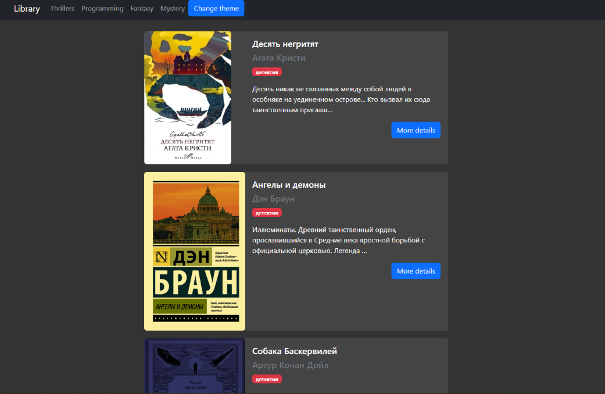

<h1 align="center">Bookshelf</h1>

<p align="center">A Django web app that turns an Excel spreadsheet into a searchable, browsable book library — no database setup required.</p>

<p align="center">
  
  
  
  
</p>

<p align="center">
  
</p>

---

## What it does

Bookshelf is a small Django application that reads a real-world XLSX file — the kind anyone keeps in Excel or Google Sheets — and exposes the rows as a web-accessible library you can browse, search, and filter.

The interesting design choice is that it uses the spreadsheet itself as the data source rather than a traditional database. This makes it easy for non-technical users to maintain their library: they edit the spreadsheet they already use, restart the app, and the changes appear on the site. No SQL, no Django admin, no migrations needed.

## Features

- **Spreadsheet-as-database** — point it at an `.xlsx` file and the rows become your catalog
- **Search and filter** through the books in the library
- **Standard Django project structure** — easy to extend with new views, models, or templates
- **Clean separation** between the data layer (XLSX reader) and the presentation layer (Django views and templates)

## Tech stack

- **Python 3.10+**
- **Django 4.x** — web framework, routing, templating
- **openpyxl** — reading and parsing the XLSX file

## Getting started

### Prerequisites

- Python 3.10 or newer ([download](https://www.python.org/downloads/))
- A copy of the source XLSX file (sample structure described in [Data format](#data-format) below)

### Installation

```bash
# Clone the repo
git clone https://github.com/AlekseiLopatin/bookshelf.git
cd bookshelf

# Create and activate a virtual environment
python -m venv venv
source venv/bin/activate   # on Windows: venv\Scripts\activate

# Install dependencies
pip install -r requirements.txt
```

### Run

```bash
# Apply Django migrations (sets up the session/auth tables)
python manage.py migrate

# Start the development server
python manage.py runserver
```

Open [http://127.0.0.1:8000/](http://127.0.0.1:8000/) in your browser. You should see the bookshelf populated with the rows from your XLSX file.

## Data format

The app expects an XLSX file with one row per book and these columns:

| Column | Type | Example |
|---|---|---|
| Title | string | *The Lord of the Rings* |
| Author | string | J.R.R. Tolkien |
| Year | integer | 1954 |
| Genre | string | Fantasy |

Place the file at `books/data/library.xlsx` (or wherever your code points — adjust to match your actual project layout). The first row should contain the column headers.

## Project structure

```
bookshelf/
├── books/                  # Django app — models, views, templates for the library
│   ├── data/               # XLSX file lives here
│   ├── templates/
│   ├── views.py
│   └── urls.py
├── config/                 # Django project — settings, root URL config
│   ├── settings.py
│   ├── urls.py
│   └── wsgi.py
├── docs/
│   └── screenshots/        # Images used in this README
├── manage.py               # Django management commands
├── requirements.txt
├── LICENSE
└── README.md
```

## Roadmap

- [ ] Pagination for libraries with hundreds of books
- [ ] Tag/genre filtering with multi-select
- [ ] Upload XLSX through the web UI instead of editing on disk
- [ ] Cover image support (read from a URL column or local path)
- [ ] Dockerfile for one-command deploy

## License

Distributed under the MIT License. See [`LICENSE`](LICENSE) for details.